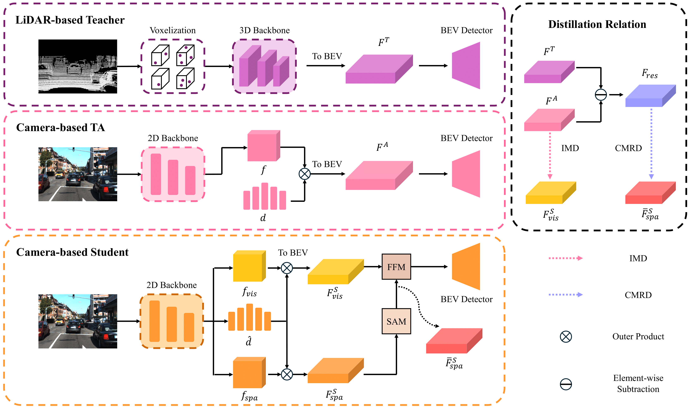
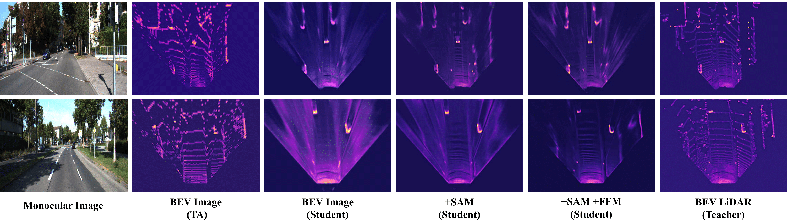

# MonoTAKD: Teaching Assistant Knowledge Distillation for Monocular 3D Object Detection

## Introduction
This is the official implementation of MonoTAKD which utilizes [OpenPCDet](https://github.com/open-mmlab/OpenPCDet) for the KITTI dataset.

<!-- [another version]() is implemented with [MMDetection3D](https://github.com/open-mmlab/mmdetection3d) for Nuscenes dataset.  -->

## Paper
[MonoTAKD: Teaching Assistant Knowledge Distillation for Monocular 3D Object Detection](https://arxiv.org/pdf/2404.04910) (arXiv, Sup. included)

<!-- [MonoTAKD: Teaching Assistant Knowledge Distillation for Monocular 3D Object Detection]() (CVPR2025, Sup. Included) -->

## News
**[2025/2/27]: MonoTAKD has been accepted by CVPR 2025** 🔥🔥🔥
* Release code and pre-trained models for the KITTI dataset.
* Visualization utils are provided to visualize detection results in both camera perspective and BEV perspective. 
* [MonoTAKD DEMO](#monotakd-demo) images & videos are included in this release.

**Notice: Due to the short schedule, instructions and pre-trained models will be released gradually in the near future. Please let us know if there are any issues and bugs.**

## Framework Overview

## BEV Feature Generation

## MonoTAKD DEMO
* Detection in CAMERA perspective

* Detection with CAMERA & BEV Side-By-Side

## Performance
### KITTI
`AP_3D` performance on the KITTI *test* set for the car category.
|   | Teacher | TA | Student | Easy| Moderate | Hard |
|---|:---:|:---:|:---:|:---:|:---:|:---:|
| [MonoTAKD](tools/cfgs/kitti_models/TAKD/TAKD-scd/kitti_R50_scd_TAKD.yaml) | [SECOND](https://drive.google.com/file/d/1UB0XE5NS0cmVunAry-v6f7Nr6d9yIIHI/view?usp=drive_link) | [CaDDN](https://drive.google.com/file/d/1OMPkZe8_lnnoUqSf0mSTQdvYBzhICX2Z/view?usp=drive_link) | [model](https://drive.google.com/file/d/1S4Uehq7ix1CE2BXwL9SmaDsrtOiNZUIN/view?usp=drive_link) |  27.91  | 19.43 | 16.51 | 
| [MonoTAKD_*Raw*](tools/cfgs/kitti_models/TAKD/TAKD-scd/cmkd_kitti_R50_scd_V2_lpcg.yaml) | [SECOND](https://drive.google.com/file/d/1UB0XE5NS0cmVunAry-v6f7Nr6d9yIIHI/view?usp=drive_link) | [CaDDN](https://drive.google.com/file/d/1OMPkZe8_lnnoUqSf0mSTQdvYBzhICX2Z/view?usp=drive_link) | [model](https://drive.google.com/file/d/1LxQWiEY4zkAbYNLkBWe5NdP2QrCcwzTF/view?usp=drive_link) | 29.86 | 21.26 | 18.27 |

### Nuscenes
|   | NDS | mAP |
|---|:---:|:---:|
| BEVFormer-R50 + TAKD  | 49.0 | 39.2 |
| BEVFormer-R101 + TAKD | 55.8 | 45.1 |
| BEVDepth-R50 + TAKD   | 53.7 | 43.0 |
| BEVDepth-R101 + TAKD  | 56.4 | 46.6 |

## Set Up MonoTAKD

### Installation
Please follow [INSTALL](docs/INSTALL.md) to install MonoTAKD.

### Getting Started
Please follow [GETTING_START](docs/GETTING_STARTED.md) to train or evaluate the models.

### Visualize Detection
Please follow [VISUALIZE_DETECTION](docs/VISUALIZE_DETECTION.md) to draw detection bounding boxes onto 3D perspective view and BEV view.

### Upload *test* set to KITTI Benchmark
Please follow [KITTI_TEST_UPLOAD_GUIDELINES](docs/KITTI_TEST_UPLOAD_GUIDELINES.md) to upload to KITTI Benchmark for evaluation.
